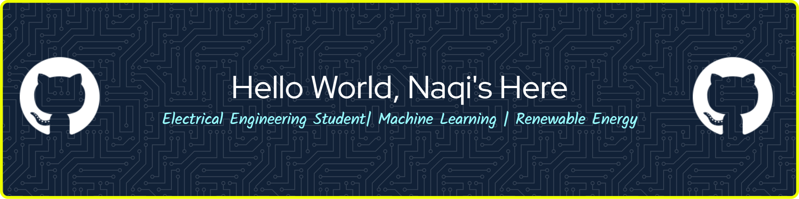

<h3 align="center">
<b>Machine Learning engineer focused on TinyML and edge devices.</b> 
<b>Applying ML to robotics and renewable energy systems.</b>
</h3>
 

#### Current Focus
Right now I'm exploring energy harvesting with ESP32 microcontrollers and sharpening my machine learning skills through a coding camp.

#### Tech Stack
Kotlin, Python, JavaScript, ESP32, Arduino, Etc

#### Learning & Explore

#### Contact Me

